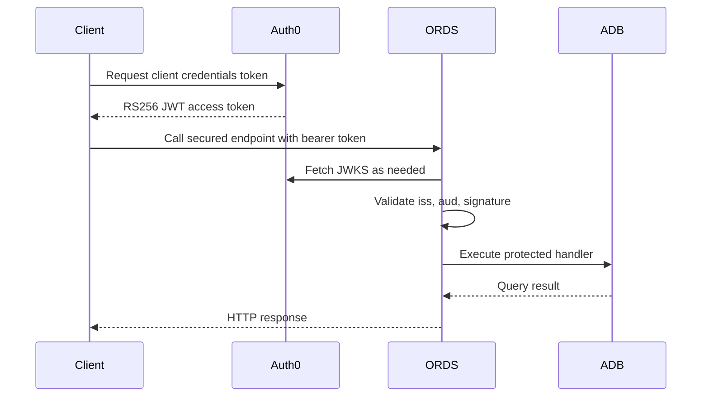

# Architecture

This repository models a straightforward resource-server flow:

- Auth0 is the authorization server and token issuer.
- The client obtains an access token from Auth0 by using the client credentials grant.
- ORDS is the resource server that receives the access token.
- ORDS validates the JWT signature through the configured JWKS URL and checks the configured issuer and audience.
- ADB hosts the REST-enabled module and the query behind the endpoint.
- ORDS privileges still decide whether a validated token is allowed to reach the handler.

## Component Roles

### Auth0

Auth0 issues RS256-signed JWT access tokens. The important claims for this example are:

- `iss`: the Auth0 tenant issuer URL
- `aud`: the API Identifier you chose in Auth0
- `scope`: the granted scopes for the machine-to-machine client

### ORDS

ORDS is not an identity provider. It does not mint the JWT in this setup. Its job is to:

- receive the bearer token
- fetch signing keys from the configured JWKS endpoint
- validate issuer and audience
- apply its own authorization model to the protected REST module

### ADB

ADB hosts the schema, sample data, and the ORDS module handler. In this repository the handler is deliberately small so the security and trust flow stay easy to inspect.

## Trust Flow

## Audience and Endpoint Are Different Things

The Auth0 API Identifier is a logical audience string. It is not the ORDS endpoint URL and it does not need to resolve on the network.

Example:

- API Identifier and `aud`: `https://api.example.com/ords-api`
- ORDS endpoint URL: `https://adb.example.com/ords/demo/oauth-demo/status`

Those two values serve different purposes:

- the audience identifies the intended resource server in the token
- the endpoint URL tells the client where to send the HTTP request

ORDS must be configured to expect the exact audience value carried in the token.

## Scope and Privilege Mapping

There are two distinct checks in this pattern:

1. JWT validation
   ORDS checks issuer, audience, and signature.
2. API authorization
   ORDS applies privileges to the endpoint path.

In a real deployment you may also align Auth0 scopes with ORDS roles or downstream authorization logic. This repository keeps that example intentionally small, but the SQL and docs call out where that mapping decision belongs.

## Production Notes

This repository is a reference implementation, not a production blueprint. Production deployments usually add:

- stronger secret handling
- vault-backed credential storage
- network controls around ORDS and JWKS access
- API gateways or WAFs
- more explicit claim-to-authorization rules
